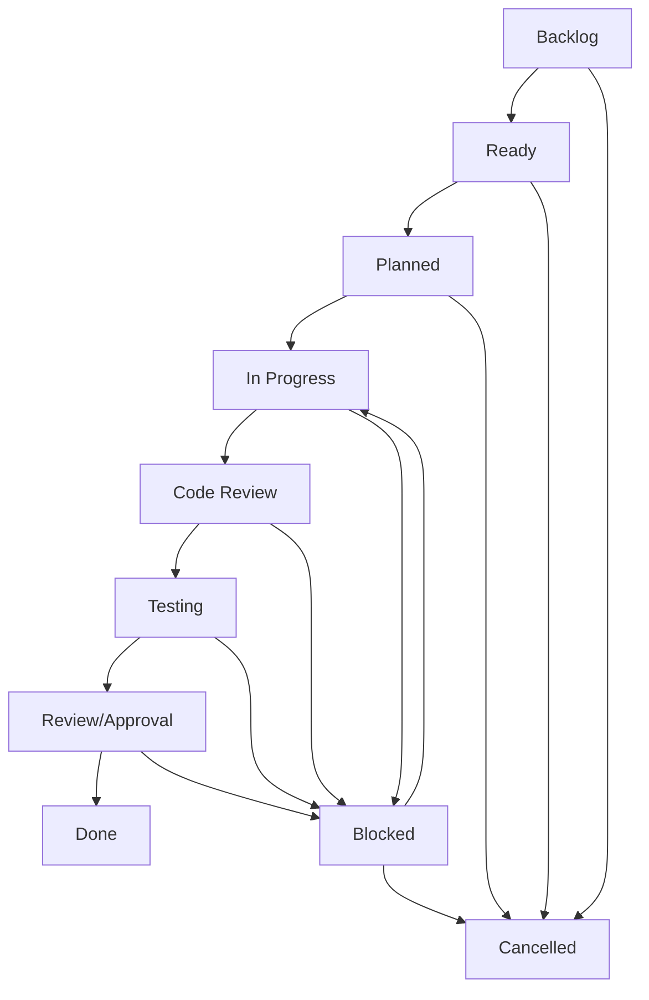

# Status Workflows and Escalation Paths

## Task Status Workflow

### Status Definitions

#### **Backlog**
- Task identified and documented
- Not yet prioritized or planned for specific sprint
- May need additional analysis or requirements gathering

#### **Ready**
- Task meets Definition of Ready criteria
- Estimated and can be included in sprint planning
- All dependencies identified and addressed

#### **Planned**
- Task selected for upcoming sprint
- Assigned to team member
- Dependencies confirmed available

#### **In Progress**
- Active development work started
- Developer has begun implementation
- Regular progress updates provided

#### **Code Review**
- Implementation complete, pending peer review
- Pull request created and awaiting approval
- Automated tests must be passing

#### **Testing**
- Code review approved, ready for QA validation
- Manual testing against acceptance criteria
- Integration and regression testing

#### **Review/Approval**
- Testing complete, awaiting stakeholder approval
- User acceptance testing if required
- Final sign-off before deployment

#### **Done**
- All Definition of Done criteria met
- Deployed to production (or ready for deployment)
- Task deliverables complete and validated

#### **Blocked**
- Progress halted due to external dependencies
- Waiting for information, resources, or prerequisite work
- Escalation may be required

#### **Cancelled**
- Task no longer needed or deprioritized
- Requirements changed or business value no longer exists
- Documented rationale for cancellation

### Status Transition Rules



### Transition Criteria

#### Backlog → Ready
- [ ] Requirements documented and clear
- [ ] Story points estimated
- [ ] Dependencies identified
- [ ] Acceptance criteria defined

#### Ready → Planned
- [ ] Sprint capacity available
- [ ] Team member assigned
- [ ] Dependencies resolved or scheduled
- [ ] Sprint goal alignment confirmed

#### Planned → In Progress
- [ ] Developer actively working on task
- [ ] Feature branch created (feature/TASK-XXX-description)
- [ ] Initial commit or work started
- [ ] Daily standup progress reported

#### In Progress → Code Review
- [ ] Implementation complete
- [ ] Self-testing completed
- [ ] Pull request created
- [ ] Automated tests passing

#### Code Review → Testing
- [ ] Peer review approved
- [ ] Code merged to development branch
- [ ] Deployed to testing environment
- [ ] Ready for QA validation

#### Testing → Review/Approval
- [ ] Manual testing completed
- [ ] All acceptance criteria validated
- [ ] No blocking defects found
- [ ] Documentation updated

#### Review/Approval → Done
- [ ] Stakeholder approval received
- [ ] Definition of Done checklist complete
- [ ] Deployed to production (or scheduled)
- [ ] Task value delivered

#### Any Status → Blocked
- [ ] External dependency preventing progress
- [ ] Blocker clearly documented
- [ ] Escalation path initiated
- [ ] Estimated resolution timeframe provided

#### Blocked → In Progress (or previous status)
- [ ] Blocking dependency resolved
- [ ] Work can resume immediately
- [ ] Impact assessment completed
- [ ] Timeline updated if necessary

#### Any Status → Cancelled
- [ ] Business justification for cancellation
- [ ] Stakeholder approval for cancellation
- [ ] Work completed to date documented
- [ ] Resources reallocated

## Escalation Paths

### Level 1: Team-Level Resolution (0-2 days)
**Triggers:**
- Technical blockers within team expertise
- Minor scope clarifications needed
- Resource allocation conflicts

**Process:**
1. Developer identifies and documents blocker
2. Team discusses in daily standup
3. Team lead facilitates resolution
4. Resolution tracked in task comments

**Learning Platform Examples:**
- TypeScript compilation errors
- Test failures after dependency updates
- Minor UI/UX clarification needs
- Code review feedback cycles

### Level 2: Project-Level Resolution (2-5 days)
**Triggers:**
- Cross-team dependencies
- Technical architecture decisions needed
- Significant scope changes
- External service integrations

**Process:**
1. Team lead escalates to project owner
2. Stakeholder meeting scheduled within 24 hours
3. Decision documented in ADR format
4. Timeline impact communicated

**Learning Platform Examples:**
- Modern service architecture decisions (TASK-012)
- Database schema changes affecting multiple features
- Third-party API integration issues
- Performance requirements exceeding current architecture

### Level 3: Organization-Level Resolution (5+ days)
**Triggers:**
- Budget or resource constraints
- Regulatory or compliance issues
- Major architectural changes
- Strategic priority conflicts

**Process:**
1. Project owner escalates to leadership
2. Cross-functional team formed if needed
3. Business case and impact analysis prepared
4. Resolution plan with timeline communicated

**Learning Platform Examples:**
- GDPR compliance requirements for student data
- Major technology stack changes
- Integration with institution systems
- Security audit findings requiring architectural changes

## Escalation Documentation Template

```markdown
## Escalation: TASK-XXX Blocker

### Blocker Summary
**Task ID:** TASK-XXX
**Current Status:** Blocked
**Blocker Type:** [Technical/Business/Resource/External]
**Escalation Level:** [1/2/3]

### Impact Assessment
**Timeline Impact:** [Days/weeks delayed]
**Affected Tasks:** [List of dependent tasks]
**Business Impact:** [User/feature impact]
**Risk Level:** [Low/Medium/High/Critical]

### Blocker Details
**Description:** [Clear description of what is blocking progress]
**Root Cause:** [Why this blocker exists]
**Attempted Solutions:** [What has been tried]
**Dependencies:** [What/who is needed to resolve]

### Resolution Request
**Needed From:** [Person/team/decision]
**By When:** [Target resolution date]
**Alternatives:** [Possible workarounds]
**Success Criteria:** [How we know it's resolved]

### Escalation History
- **Date/Time:** [When escalation started]
- **Escalated To:** [Person/team]
- **Response:** [Action taken or decision made]
```

## Status Tracking Guidelines

### Daily Operations
- **Standups**: Review blocked tasks and escalation status
- **Status Updates**: Developers update task status within 24 hours of changes
- **Blocker Monitoring**: Team lead reviews blocked tasks daily
- **Escalation Review**: Project owner reviews Level 2+ escalations daily

### Weekly Operations
- **Status Report**: Summary of sprint progress and blocking issues
- **Escalation Review**: Review unresolved escalations and timeline impact
- **Process Improvement**: Identify patterns in blockers for process improvements

### Sprint Operations
- **Sprint Planning**: Review blocked tasks and escalation impact on capacity
- **Sprint Review**: Document lessons learned about escalation effectiveness
- **Retrospectives**: Discuss escalation patterns and process improvements

## Automation and Tools

### Status Automation
- **GitHub Integration**: Automatically update status based on PR state
- **CI/CD Integration**: Automatic status transitions for testing phases
- **Notification Rules**: Alert stakeholders of status changes and escalations

### Escalation Tracking
- **SLA Monitoring**: Track escalation response times against SLA targets
- **Escalation Metrics**: Monitor escalation frequency and resolution effectiveness
- **Stakeholder Notifications**: Automatic alerts for escalation level changes

### Learning Platform Specific Workflows

#### Modern Service Migration (TASK-012)
- **Phase 2 Status Tracking**: Special workflow for gradual adoption tasks
- **Performance Monitoring**: Automatic status updates based on performance metrics
- **Compatibility Validation**: Additional testing phase for backward compatibility

#### Security and Compliance
- **Security Review Phase**: Additional review step for authentication/authorization changes
- **Compliance Validation**: Special approval process for student data handling
- **Audit Trail**: Enhanced documentation for regulatory compliance

This workflow system ensures clear task progression while providing structured escalation paths to resolve blockers quickly and maintain development velocity.