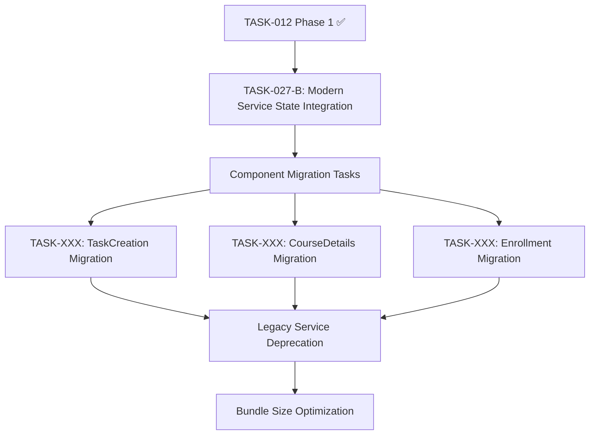
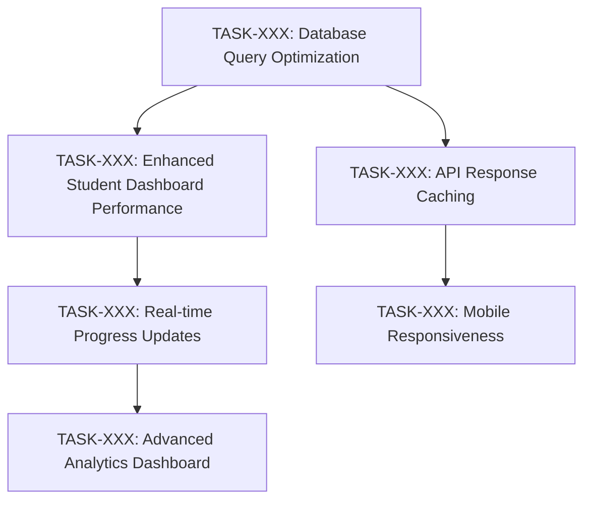
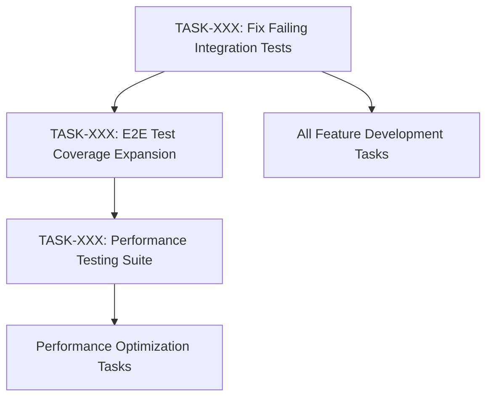

# Dependency Map - Learning Platform Tasks

> **Visual and structured representation of task dependencies and blocking relationships**

## Dependency Overview

**Last Updated**: [Current Date]
**Critical Path Length**: [Number] sprints
**Active Blockers**: [Count] blocking relationships
**Risk Level**: [Low/Medium/High] based on dependency complexity

## High-Level Dependency Categories

### Modern Service Migration (TASK-012 Ecosystem)
The continuing modern service architecture implementation creates several dependency chains:

### User Experience Enhancement Chain
User-facing improvements that build upon each other:

### Testing and Quality Infrastructure
Quality improvements that support other development:

## Detailed Dependency Matrix

### P1 Task Dependencies

| Task ID | Title | Depends On | Blocks | Risk Level |
|---------|--------|------------|---------|------------|
| TASK-027-B | Modern Service State Integration | TASK-012 ✅ | Component migrations | Medium |
| TASK-046 | Critical Dependency Security Updates | None | All development | Low |
| TASK-XXX | Fix Critical Grading Bug | None | User trust, grading workflow | Low |
| TASK-XXX | TaskCreation Migration | TASK-027-B | Legacy deprecation | Medium |
| TASK-XXX | CourseDetails Migration | TASK-027-B | Legacy deprecation | Medium |
| TASK-XXX | Real-time Progress Updates | Database optimization | Advanced features | High |
| TASK-XXX | Enhanced Dashboard Performance | Database optimization | User satisfaction | Medium |
| TASK-XXX | Fix Integration Tests | None | All CI/CD reliability | Low |

### P2 Task Dependencies

| Task ID | Title | Depends On | Blocks | Risk Level |
|---------|--------|------------|---------|------------|
| TASK-XXX | Enhanced Analytics Dashboard | Dashboard performance, Real-time updates | Advanced analytics | Medium |
| TASK-XXX | Batch Grading Interface | None | Instructor productivity | Low |
| TASK-XXX | Course Progress Visualization | Dashboard performance | Student engagement | Low |
| TASK-XXX | Database Query Optimization | None | All performance tasks | Medium |
| TASK-XXX | Frontend Bundle Optimization | Modern service migration | Mobile experience | Medium |
| TASK-XXX | API Response Caching | None | Performance improvements | Low |
| TASK-XXX | Mobile Responsiveness | Bundle optimization | Mobile strategy | Medium |
| TASK-XXX | Accessibility Compliance | None | Public sector adoption | Low |

### P3 Task Dependencies

| Task ID | Title | Depends On | Blocks | Risk Level |
|---------|--------|------------|---------|------------|
| EPIC-XXX | AI Learning Path Recommendations | Analytics infrastructure | AI features | High |
| EPIC-XXX | Advanced Analytics ML | Data collection, Performance | Business intelligence | High |
| EPIC-XXX | Mobile App Development | API stability, Responsive design | Mobile strategy | High |
| TASK-XXX | LTI Support | API standardization | Educational integrations | Medium |
| TASK-XXX | SCORM Integration | File handling, Storage | Content standards | Medium |

## Critical Path Analysis

### Critical Path (Longest Dependency Chain)
1. **TASK-027-B**: Modern Service State Integration (5 pts) - Sprint N
2. **TASK-XXX**: Component Migrations (8 pts total) - Sprint N+1
3. **TASK-XXX**: Legacy Service Deprecation (3 pts) - Sprint N+2
4. **TASK-XXX**: Bundle Size Optimization (3 pts) - Sprint N+2
5. **TASK-XXX**: Performance Validation (2 pts) - Sprint N+3

**Total Critical Path**: 21 story points (~3 sprints)

### Alternative Paths
If critical path is blocked, these parallel tracks can continue:

#### Performance Track
- Database Query Optimization → API Caching → Performance Testing
- **Duration**: 2 sprints, 13 story points

#### User Experience Track
- Mobile Responsiveness → Accessibility → Dark Mode → Advanced Themes
- **Duration**: 3 sprints, 19 story points

#### Quality Track
- Integration Tests → E2E Tests → Performance Tests → Documentation
- **Duration**: 2 sprints, 15 story points

## Blocker Management

### Current Active Blockers
*As of [Current Date]*

**Currently**: No active blockers ✅

### Recently Resolved Blockers
| Date Resolved | Blocker | Affected Tasks | Resolution |
|---------------|---------|----------------|------------|
| [Date] | CI Pipeline Issues | All development | Pipeline configuration fixed |
| [Date] | TypeScript Compilation | Modern services | Dependency updates completed |

### Potential Upcoming Blockers

#### High Risk Blockers
1. **Modern Service Architecture Complexity**
   - **Risk**: TASK-027-B more complex than estimated
   - **Impact**: Delays all component migration tasks
   - **Mitigation**: Daily check-ins, scope reduction plan ready
   - **Contingency**: Parallel legacy support approach

2. **Database Performance Bottlenecks**
   - **Risk**: Query optimization insufficient for real-time features
   - **Impact**: Real-time progress updates may need architecture changes
   - **Mitigation**: Performance benchmarking, caching strategies
   - **Contingency**: Batch update approach with periodic sync

#### Medium Risk Blockers
1. **Third-party Service Stability**
   - **Risk**: External APIs for integrations unreliable
   - **Impact**: LTI, SCORM, and other integration tasks
   - **Mitigation**: Fallback providers, local alternatives
   - **Contingency**: Delayed integration rollout

2. **Mobile Framework Choice**
   - **Risk**: React Native vs. Progressive Web App decision
   - **Impact**: Mobile app development direction
   - **Mitigation**: Technical spike to evaluate options
   - **Contingency**: Web-first approach with mobile optimization

## Dependency Resolution Strategies

### Parallel Development
Where possible, work on independent tracks simultaneously:
- **Frontend-Backend Split**: UI work can proceed with mock data
- **Component Isolation**: Independent components can be developed in parallel
- **Testing Pipeline**: Quality improvements can proceed independently

### Incremental Delivery
Break large dependencies into smaller, deliverable pieces:
- **Modern Service Migration**: Component-by-component rather than all-at-once
- **Performance Optimization**: Database → API → Frontend optimization sequence
- **User Experience**: Feature-by-feature enhancement rather than complete redesign

### Risk Mitigation
Prepare alternatives for high-risk dependencies:
- **Technical Spikes**: Research alternatives before committing to approach
- **Proof of Concepts**: Validate complex integrations early
- **Rollback Plans**: Maintain ability to revert changes if dependencies fail

## Dependency Tracking Process

### Daily Monitoring
- **Standup Reviews**: Check for new blockers or dependency changes
- **Progress Updates**: Verify dependent tasks are on track
- **Risk Assessment**: Identify potential upcoming blockers

### Weekly Dependency Review
- **Dependency Map Updates**: Reflect current reality and new information
- **Risk Level Adjustments**: Update based on progress and learnings
- **Mitigation Planning**: Prepare contingencies for identified risks

### Sprint Planning Integration
- **Dependency Validation**: Ensure prerequisite tasks are completed
- **Risk-Based Scheduling**: Prioritize high-risk dependencies
- **Parallel Path Planning**: Identify work that can proceed independently

## Tools and Automation

### Dependency Tracking Tools
- **Task Management**: Links between tasks in backlog system
- **Visual Mapping**: Mermaid diagrams for complex relationships
- **Status Automation**: Automatic updates when prerequisite tasks complete

### Alerting and Notifications
- **Blocker Alerts**: Immediate notification when tasks become blocked
- **Dependency Completion**: Notify dependent task owners when prerequisites finish
- **Risk Escalation**: Automatic escalation for high-risk dependency delays

## Success Metrics

### Dependency Health Indicators
- **Blocker Duration**: Average time tasks spend in blocked status
- **Critical Path Adherence**: Percentage of critical path tasks completed on time
- **Dependency Accuracy**: Percentage of identified dependencies that prove accurate
- **Parallel Work Efficiency**: Story points completed in parallel vs. sequential work

### Process Improvement Metrics
- **Dependency Discovery**: How early in the process dependencies are identified
- **Risk Prediction**: Accuracy of risk assessments for dependency-related delays
- **Mitigation Effectiveness**: Success rate of contingency plans when activated

---

**Note**: This dependency map is a living document that should be updated as new dependencies are discovered and existing ones are resolved. Success depends on proactive identification and management of blocking relationships to maintain development velocity.