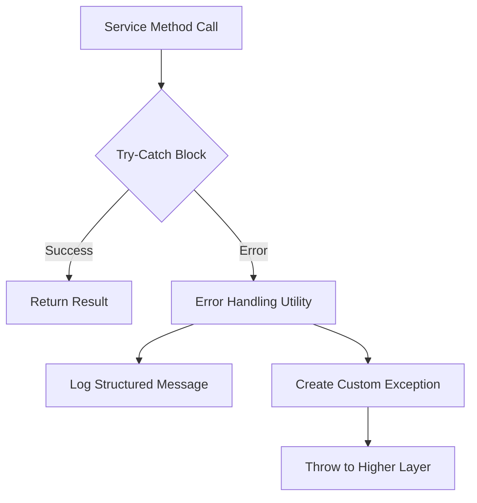

# ADR-019: Managed Exception Handling in Service Layer

## Table of Contents

- [Context](#context)
- [Decision](#decision)
  - [Key Changes](#key-changes)
- [Consequences](#consequences)
  - [Benefits](#benefits)
  - [Drawbacks](#drawbacks)
- [Implementation](#implementation)
  - [Steps](#steps)
  - [Validation Criteria](#validation-criteria)
- [Related Documents](#related-documents)

---

## Context

> 🔍 **Current Issue**: Unstructured exception handling across services

Currently, multiple services in the codebase log raw exception traces when errors occur. This behavior:

- 📉 **Reduces clarity** in logs by exposing low-level details
- 👤 **Impacts user experience** by not providing meaningful feedback
- 🐛 **Complicates debugging** due to unstructured error information

For example, the `learningTaskService` logs a `404 Not Found` error trace when attempting to fetch a non-existent task by ID. Similarly, other services like `ProgressService` and `EnrollmentService` exhibit similar issues. Instead, a managed exception with a structured log message would be more appropriate.

---

## Decision

> 🛠️ **Solution**: Implement centralized exception handling

Introduce a managed exception handling mechanism in the service layer. This will:

1. Catch exceptions (e.g., `AxiosError`) at the service level
2. Log structured messages with relevant context (e.g., "Task not found for ID: 194")
3. Return a meaningful response or rethrow a custom exception for higher layers to handle

### Key Changes

- 🔄 Implement a centralized error-handling utility in the service layer
- 🔄 Update all identified services (`ProgressService`, `LearningTaskService`, `EnrollmentService`, `CourseService`, and `AuthEventService`) to use this utility
- 🔄 Modify integration tests for each service to validate log messages instead of raw traces

---

## Consequences

### Benefits

- ✅ **Improved Debugging**: Structured logs make it easier to identify and resolve issues
- ✅ **Enhanced User Experience**: Users receive meaningful feedback instead of raw error traces
- ✅ **Consistency**: Standardized error handling across services

### Drawbacks

- ⚠️ **Implementation Effort**: Requires changes to existing services and tests
- ⚠️ **Performance Overhead**: Slight increase in processing due to additional logging

---

## Implementation

### Steps

1. **Create Error-Handling Utility**:
   - Define a utility to log errors and generate custom exceptions

2. **Update Identified Services**:
   - Wrap API calls in try-catch blocks for:
     - `ProgressService`
     - `LearningTaskService`
     - `EnrollmentService`
     - `CourseService`
     - `AuthEventService`
   - Use the utility to handle errors in each service

3. **Modify Integration Tests**:
   - Validate structured log messages instead of raw traces for all updated services

4. **Documentation**:
   - Update service documentation to reflect the new error-handling approach for all services

### Validation Criteria

| Criteria | Description |
|----------|-------------|
| Test Coverage | All integration tests pass with structured log messages |
| Log Quality | Logs contain meaningful error information without raw traces |

---

## Related Documents

- [ADR-018: Task Status Tracking Files Structure](memory_bank/ADRs/ADR-018-Task-Status-Tracking-Files-Structure.md)
- [Task Management Lifecycle](.roo/rules/processes/Task-Management.md)

