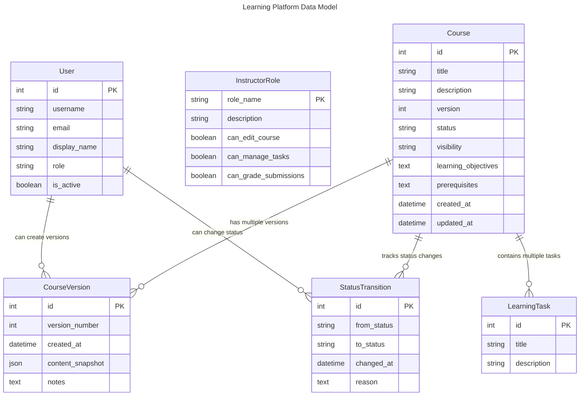
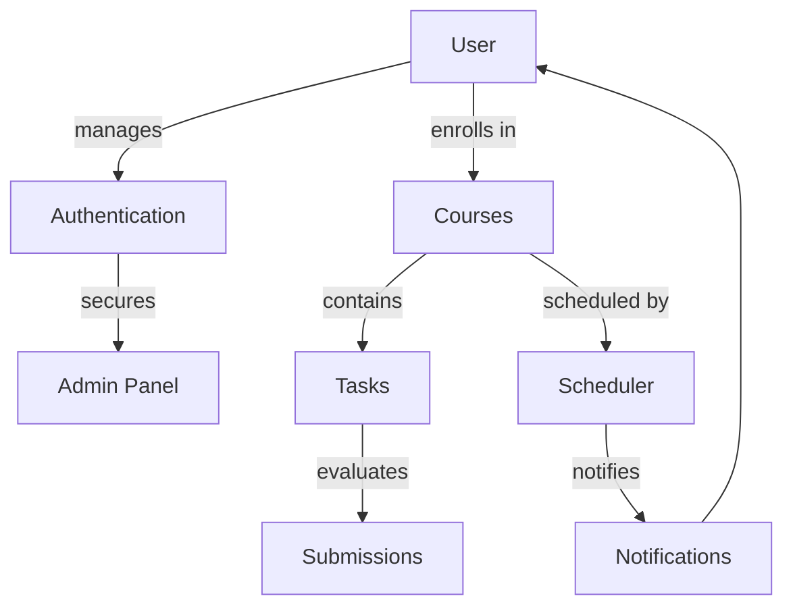

# Learning Platform Data Model

## Overview

This document provides a comprehensive data model representation for the Learning Platform, capturing the intricate relationships between different entities across the backend.

## Entity Relationship Diagram

## Component Diagram

## Model Descriptions

### User Model (App: LearningPlatform)
- Represents platform users with roles like admin, instructor, student
- Unique email address
- Customizable display name
- Role-based access control

### Course Model (App: LearningPlatform)
- Supports versioning and status tracking
- Multiple visibility levels (Private, Internal, Public)
- Supports learning objectives and prerequisites
- Tracks course creation and update timestamps

### Instructor Role Model (App: LearningPlatform)
- Defines granular permissions for course management
- Supports roles like Lead, Assistant, and Guest Instructors
- Configurable permissions for course editing, task management, and grading

### Course Version (App: LearningPlatform)
- Maintains version history of courses
- Stores content snapshots for each version
- Supports version comparison and tracking

### Status Transition (App: LearningPlatform)
- Tracks course status changes
- Records who made the change and when
- Provides audit trail for course lifecycle

### Learning Task (App: LearningPlatform)
- Associated with courses
- Supports task management within courses

## Key Relationships
- Users can be assigned multiple roles in different courses
- Courses can have multiple versions and instructors
- Detailed permission and status tracking across the platform

## Design Principles
- Flexible role-based access control
- Comprehensive versioning and status management
- Support for complex course and user interactions
