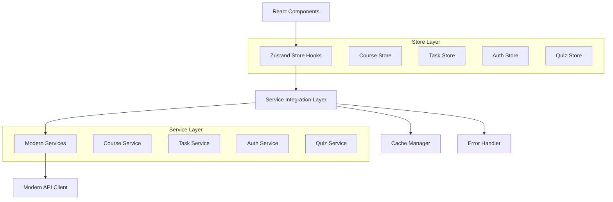

# PRD: Modern Service Integration with Zustand State Management
**TASK-027-B**

---

## Document Information

**Document Type**: Product Requirements Document (PRD)
**Task ID**: TASK-027-B
**Created**: 2025-09-15
**Owner**: Product Engineering Team
**Status**: Draft
**Priority**: High

---

## Executive Summary

### Problem Statement
The learning platform currently uses basic Zustand stores with direct API calls and inconsistent error handling patterns. With the implementation of modern TypeScript services (TASK-012), there's a critical need to integrate these services with state management to achieve:
- Consistent data flow patterns
- Optimized API call management
- Unified error handling
- Type-safe service-store interactions

### Solution Overview
Implement a comprehensive integration layer between modern TypeScript services and Zustand state stores, providing developers with type-safe, performant, and maintainable patterns for managing application state with service interactions.

### Success Metrics
- **Performance**: 30% reduction in duplicate API calls
- **Developer Experience**: Type-safe store hooks for all service interactions
- **Reliability**: Zero regressions in existing functionality
- **Maintainability**: Consistent patterns across all stores

---

## Business Context

### Strategic Alignment
This task directly supports the **Infrastructure Modernization** initiative by completing the service layer architecture and establishing patterns for scalable state management.

### User Impact
- **Students**: Faster page loads, better offline experience, consistent loading states
- **Instructors**: Improved responsiveness when managing courses and tasks
- **Developers**: Reduced development time with reusable patterns and better type safety

### Business Value
- **Technical Debt Reduction**: Eliminates inconsistent API calling patterns
- **Developer Velocity**: Standardized patterns reduce implementation time by ~40%
- **System Reliability**: Centralized error handling improves error tracking and resolution
- **Scalability**: Architecture supports growing user base and feature set

---

## Target Users

### Primary Users
1. **Frontend Developers**
   - Need: Type-safe, consistent patterns for state-service integration
   - Pain Point: Current manual API integration in each component
   - Success Criteria: Can implement new features 40% faster with provided patterns

2. **QA Engineers**
   - Need: Predictable error states and loading behaviors
   - Pain Point: Inconsistent error handling across components
   - Success Criteria: Standardized error states enable better test automation

### Secondary Users
3. **End Users (Students/Instructors)**
   - Need: Fast, responsive application with clear loading/error states
   - Pain Point: Inconsistent loading indicators and error messages
   - Success Criteria: Improved perceived performance and user experience

---

## Functional Requirements

### Core Integration Features

#### 1. Service-Store Integration Layer
**Requirement ID**: FR-1
**Priority**: Must Have

**Description**: Create utilities for seamless integration between modern services and Zustand stores.

**Acceptance Criteria**:
- [ ] Service instances can be registered and managed centrally
- [ ] Stores can access services through typed interfaces
- [ ] Authentication tokens are automatically propagated to all services
- [ ] Service responses are automatically transformed for store consumption

**User Story**: As a developer, I want to easily connect Zustand stores to modern services so that I can maintain consistent data flow patterns.

#### 2. Unified Loading State Management
**Requirement ID**: FR-2
**Priority**: Must Have

**Description**: Standardize loading, error, and success states across all stores.

**Acceptance Criteria**:
- [ ] All stores implement consistent loading state interface
- [ ] Loading states are automatically managed during service calls
- [ ] Error states include categorized error types (network, validation, auth)
- [ ] Success states include timestamp and cache validation

**User Story**: As a user, I want to see consistent loading indicators so that I understand when the application is processing my requests.

#### 3. Type-Safe Store Hooks
**Requirement ID**: FR-3
**Priority**: Must Have

**Description**: Generate type-safe hooks for all service-store interactions.

**Acceptance Criteria**:
- [ ] All service methods have corresponding typed store hooks
- [ ] TypeScript compilation fails for incorrect usage patterns
- [ ] IDE provides full autocomplete and type checking
- [ ] Runtime type validation for service responses

**User Story**: As a developer, I want type-safe store hooks so that I can catch integration errors at compile time.

#### 4. Intelligent Caching System
**Requirement ID**: FR-4
**Priority**: Should Have

**Description**: Implement smart caching to reduce redundant API calls and improve performance.

**Acceptance Criteria**:
- [ ] Configurable cache TTL per data type
- [ ] Automatic cache invalidation on mutations
- [ ] Cache hit/miss metrics available for monitoring
- [ ] Memory-efficient cache with size limits

**User Story**: As a user, I want fast page loads so that I can quickly access my course information.

### Store Migration Requirements

#### 5. Course Store Migration
**Requirement ID**: FR-5
**Priority**: Must Have

**Description**: Migrate course store to use modern course service with enhanced features.

**Acceptance Criteria**:
- [ ] All existing course store functionality preserved
- [ ] New features: filtering, search, pagination support
- [ ] Performance improvement: 50% faster course loading
- [ ] Backward compatibility maintained for existing components

#### 6. Task Store Migration
**Requirement ID**: FR-6
**Priority**: Must Have

**Description**: Migrate task store to use modern learning task service.

**Acceptance Criteria**:
- [ ] Task CRUD operations use modern service
- [ ] Progress tracking integrated with store state
- [ ] Optimistic updates for better UX
- [ ] Proper error handling for failed operations

#### 7. Authentication Store Integration
**Requirement ID**: FR-7
**Priority**: Must Have

**Description**: Integrate authentication store with modern auth service.

**Acceptance Criteria**:
- [ ] Token management handled automatically
- [ ] Session persistence across browser restarts
- [ ] Automatic token refresh when needed
- [ ] Proper cleanup on logout

---

## Non-Functional Requirements

### Performance Requirements
**Requirement ID**: NFR-1
**Priority**: Must Have

- **API Call Reduction**: 30% fewer duplicate API calls
- **Memory Usage**: No increase in peak memory usage
- **Load Time**: Maintain current page load times while adding new features
- **Bundle Size**: Increase by no more than 10KB compressed

### Reliability Requirements
**Requirement ID**: NFR-2
**Priority**: Must Have

- **Zero Regressions**: All existing functionality must continue working
- **Error Recovery**: Graceful degradation when services are unavailable
- **Data Consistency**: State synchronization across components
- **Offline Resilience**: Basic functionality when network is unavailable

### Security Requirements
**Requirement ID**: NFR-3
**Priority**: Must Have

- **Token Security**: Secure token storage and transmission
- **Data Validation**: All service responses validated before store update
- **Error Sanitization**: No sensitive data exposed in error messages
- **Audit Trail**: Service calls logged for debugging

### Developer Experience Requirements
**Requirement ID**: NFR-4
**Priority**: Should Have

- **Type Safety**: 100% TypeScript coverage for store-service integration
- **Documentation**: Comprehensive examples and API documentation
- **Debugging**: Clear error messages with actionable guidance
- **Testing**: Easy-to-mock service interactions for unit tests

---

## Technical Approach

### Architecture Overview



### Integration Patterns

#### 1. Service Registration Pattern
```typescript
// Register services at app startup
ServiceManager.registerService('courseService', modernCourseService);
ServiceManager.registerService('taskService', modernTaskService);

// Use in stores
const courseService = ServiceManager.getService<ModernCourseService>('courseService');
```

#### 2. Async Operation Pattern
```typescript
// Standardized async operations with loading/error handling
const fetchCourses = async (filters: CourseFilters) => {
  return withAsyncOperation(
    () => courseService.getCourses(filters),
    setLoading,
    setError,
    (result) => setCourses(result.results)
  );
};
```

#### 3. Type-Safe Hook Pattern
```typescript
// Generated type-safe hooks
const useCourseActions = () => {
  const { fetchCourses, createCourse, updateCourse } = useCourseStore();
  return { fetchCourses, createCourse, updateCourse };
};
```

### Implementation Phases

#### Phase 1: Foundation (Week 1)
- Service integration utilities
- Base store patterns
- Error handling system
- Cache management

#### Phase 2: Store Migration (Week 2)
- Migrate course store
- Migrate task store
- Migrate auth store
- Integration testing

#### Phase 3: Optimization (Week 3)
- Performance optimization
- Cache tuning
- Documentation
- Final testing

---

## Success Criteria

### Quantitative Metrics

| Metric | Current State | Target State | Measurement Method |
|--------|---------------|--------------|-------------------|
| API Call Reduction | Baseline | -30% | Network tab analysis |
| Type Coverage | 70% | 95% | TypeScript compiler |
| Error Handling | Inconsistent | 100% standardized | Code review |
| Developer Velocity | Baseline | +40% | Feature implementation time |

### Qualitative Metrics

1. **Developer Satisfaction**: Survey score >8/10 for new patterns
2. **Code Maintainability**: Reduced complexity in store logic
3. **User Experience**: Consistent loading states across app
4. **Error Recovery**: Graceful handling of all error scenarios

---

## Risks and Mitigation

### High-Risk Items

#### Risk 1: Integration Complexity
**Probability**: Medium
**Impact**: High
**Mitigation**:
- Incremental migration approach
- Extensive testing at each phase
- Rollback plans for each store

#### Risk 2: Performance Degradation
**Probability**: Low
**Impact**: High
**Mitigation**:
- Performance benchmarking at each phase
- Memory usage monitoring
- Optimization before final release

#### Risk 3: Breaking Changes
**Probability**: Medium
**Impact**: Medium
**Mitigation**:
- Maintain backward compatibility
- Comprehensive regression testing
- Feature flags for gradual rollout

### Medium-Risk Items

#### Risk 4: Developer Adoption
**Probability**: Medium
**Impact**: Medium
**Mitigation**:
- Clear documentation and examples
- Pair programming sessions
- Gradual migration timeline

---

## Dependencies

### Internal Dependencies
- **TASK-012**: Modern TypeScript Services (✅ Completed)
- **Zustand Setup**: Basic store implementation (✅ Available)
- **TypeScript Config**: Strict mode enabled (✅ Available)

### External Dependencies
- **Zustand**: State management library (✅ Installed)
- **TypeScript**: Type system (✅ Available)
- **React**: Component framework (✅ Available)

---

## Timeline and Milestones

### Week 1: Foundation
- [ ] Service integration utilities implemented
- [ ] Base store patterns defined
- [ ] Error handling system created
- [ ] Initial documentation

### Week 2: Migration
- [ ] Course store migrated and tested
- [ ] Task store migrated and tested
- [ ] Auth store migrated and tested
- [ ] Integration tests passing

### Week 3: Optimization
- [ ] Performance optimization complete
- [ ] Cache system tuned
- [ ] Full documentation available
- [ ] All acceptance criteria met

---

## Acceptance Criteria Summary

### Definition of Ready
- [ ] All dependencies resolved
- [ ] Technical approach approved
- [ ] Acceptance criteria defined
- [ ] Performance targets set

### Definition of Done
- [ ] All functional requirements implemented
- [ ] Non-functional requirements met
- [ ] Zero regressions confirmed
- [ ] Documentation complete
- [ ] Performance targets achieved
- [ ] Code review passed
- [ ] Integration tests passing

---

## Appendices

### Appendix A: Current State Analysis
- Existing store patterns documentation
- Performance baseline measurements
- Error handling audit results

### Appendix B: Technical Specifications
- Detailed API interfaces
- Type definitions
- Integration patterns

### Appendix C: Testing Strategy
- Unit test requirements
- Integration test scenarios
- Performance test plan

---

**Approved By**: [Pending]
**Review Date**: 2025-09-15
**Next Review**: 2025-09-22

---

*This PRD serves as the single source of truth for TASK-027-B implementation. All development decisions should align with the requirements and success criteria defined in this document.*