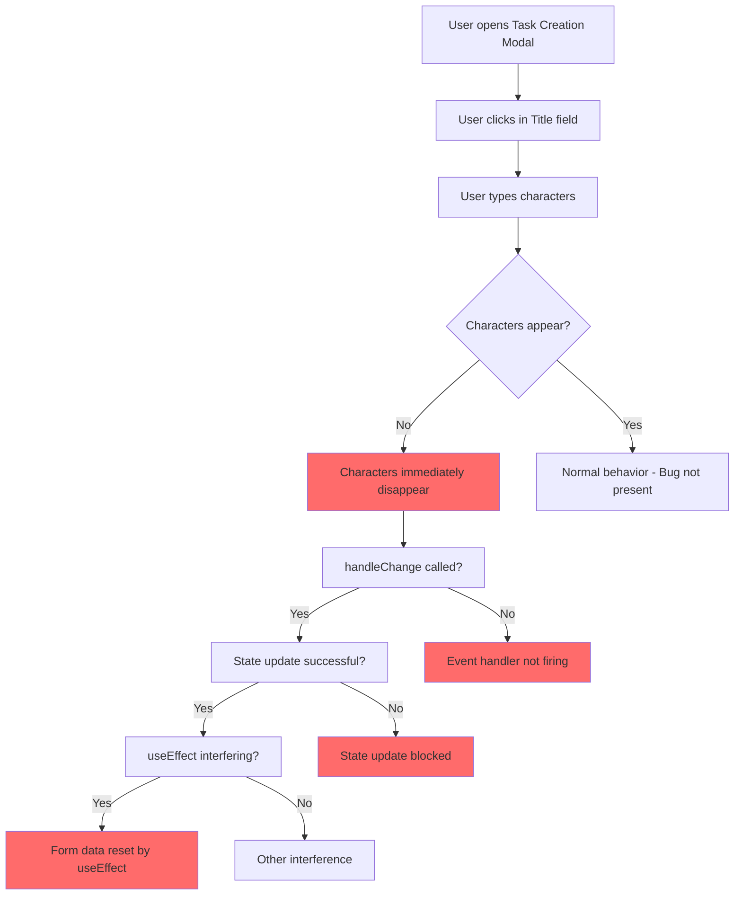

## Critical Bug Report: Task Title Input Field Auto-Clearing Issue

### **Bug ID**: BUG-2025-001

**Priority**: Critical
**Severity**: High
**Status**: Open
**Reporter**: [Your Name]
**Date**: 2025-06-27
**Environment**: Development (localhost:5173)

---

### **Summary**

The "Task Title" input field in the course task creation modal becomes completely non-functional, with any typed characters being immediately removed or deleted by background JavaScript code, preventing users from creating tasks with meaningful titles.

**Scope Note**: This task explicitly includes implementing comprehensive end-to-end (E2E) test coverage for the full UI flow of task creation via the modal. E2E tests must be developed as part of resolving this defect to ensure the functionality works correctly and to prevent regression issues.

### **Environment Details**

- **URL**: `http://localhost:5173/instructor/courses/703`
- **Action**: Add Task (Task Creation Modal)
- **Component**: [`TaskCreation.tsx`](frontend/src/components/taskCreation/TaskCreation.tsx)
- **Browser**: [Please specify - Chrome, Firefox, Safari, Edge]
- **Browser Version**: [Please specify]
- **Operating System**: [Please specify]
- **Screen Resolution**: [Please specify]
- **Device Type**: Desktop/Mobile/Tablet

---

### **Steps to Reproduce**

1. **Navigate** to instructor course page: `http://localhost:5173/instructor/courses/703`
2. **Click** the "Create Task" or "Add Task" button
3. **Wait** for the task creation modal to open
4. **Locate** the "Task Title" input field (should have label "Task Title")
5. **Click** inside the title input field to focus it
6. **Type** any characters (e.g., "My New Task")
7. **Observe** the behavior of the input field

### **Expected Behavior**

- Characters typed into the "Task Title" field should remain visible
- The input field should accept and retain text input
- Users should be able to create tasks with custom titles
- The form should validate and submit successfully with a proper title

### **Actual Behavior**

- Characters typed into the "Task Title" field are immediately removed/deleted
- The input field appears to clear itself in real-time
- No text can be retained in the title field
- Task creation becomes impossible due to title validation requirements

---

### **Technical Analysis**

#### **Affected Component**

The issue occurs in the [`TaskCreation`](frontend/src/components/taskCreation/TaskCreation.tsx:179-188) component, specifically in the title TextField:

```tsx
<TextField
  label="Task Title"
  name="title"
  value={formData.title || ''}
  onChange={handleChange}
  fullWidth
  error={!!error && !formData.title}
  helperText={error && !formData.title ? error : ''}
  sx={{marginBottom: 2}}
/>
```

#### **Potential Root Causes**

1. **State Management Conflict**: The [`useEffect`](frontend/src/components/taskCreation/TaskCreation.tsx:55-72) hook may be resetting form data inappropriately:

   ```tsx
   useEffect(() => {
     if (open) {
       if (!previouslyOpen || JSON.stringify(task) !== JSON.stringify(formData)) {
         setFormData({
           title: '',
           description: '',
           is_published: false,
           ...task,
         });
       }
     }
   }, [open, previouslyOpen, task]);
   ```

2. **Event Handler Issues**: The [`handleChange`](frontend/src/components/taskCreation/TaskCreation.tsx:74-80) function may not be updating state correctly:

   ```tsx
   const handleChange = (e: React.ChangeEvent<HTMLInputElement | HTMLTextAreaElement>) => {
     const {name, value} = e.target;
     setFormData(prev => ({
       ...prev,
       [name]: value,
     }));
   };
   ```

3. **Parent Component Interference**: External props or state updates may be overriding local form state
4. **React Strict Mode**: Double-rendering in development mode causing state conflicts
5. **Concurrent State Updates**: Race conditions between multiple state setters

---

### **Console Error Logs**

**Instructions for Reporter**: Please open browser Developer Tools (F12), go to Console tab, reproduce the issue, and paste any error messages here:

```
[Paste console errors here]
```

**Common errors to look for**:

- React state update warnings
- Uncontrolled/controlled component warnings
- Event handler errors
- Validation errors

---

### **Network Activity**

**Instructions for Reporter**: Check Network tab in Developer Tools for any suspicious API calls during typing:

```
[Paste relevant network requests here]
```

---

### **Debugging Information**

#### **Component State Inspection**

Add these temporary debug logs to [`TaskCreation.tsx`](frontend/src/components/taskCreation/TaskCreation.tsx:74-80):

```tsx
const handleChange = (e: React.ChangeEvent<HTMLInputElement | HTMLTextAreaElement>) => {
  console.log('handleChange called:', { name: e.target.name, value: e.target.value });
  const {name, value} = e.target;
  setFormData(prev => {
    console.log('Previous formData:', prev);
    const newData = { ...prev, [name]: value };
    console.log('New formData:', newData);
    return newData;
  });
};
```

#### **useEffect Monitoring**

Add debug logging to the [`useEffect`](frontend/src/components/taskCreation/TaskCreation.tsx:55-72):

```tsx
useEffect(() => {
  console.log('useEffect triggered:', { open, previouslyOpen, task, formData });
  // ... rest of effect
}, [open, previouslyOpen, task]);
```

---

### **Suggested Troubleshooting Steps**

#### **For Developers**

1. **Verify State Updates**:
   - Add console.log statements in [`handleChange`](frontend/src/components/taskCreation/TaskCreation.tsx:74-80)
   - Monitor formData state changes
   - Check if useEffect is interfering

2. **Check Parent Component**:
   - Examine how [`TaskCreation`](frontend/src/components/taskCreation/TaskCreation.tsx) is used in parent components
   - Verify props being passed (especially `task` prop)
   - Look for external state management interference

3. **Test Isolation**:
   - Create a minimal reproduction case
   - Test with different course IDs
   - Test in different browsers

4. **React DevTools**:
   - Use React Developer Tools to inspect component state
   - Monitor state changes in real-time
   - Check for unnecessary re-renders

#### **For QA/Testers**

1. **Browser Testing**:
   - Test in Chrome, Firefox, Safari, Edge
   - Test in incognito/private mode
   - Clear browser cache and cookies

2. **Input Variations**:
   - Try different types of input (letters, numbers, special characters)
   - Test copy-paste functionality
   - Test with different input speeds (fast/slow typing)

3. **Modal State Testing**:
   - Close and reopen the modal
   - Test with different course IDs
   - Test editing existing tasks vs. creating new ones

---

### **Workaround**

Currently, no known workaround exists. Users cannot create tasks until this issue is resolved.

---

### **Impact Assessment**

- **User Impact**: Critical - Users cannot create new tasks
- **Business Impact**: High - Core functionality is broken
- **Affected Users**: All instructors attempting to create course tasks
- **Data Loss Risk**: None (no data corruption, just functionality blocked)

---

### **Related Components**

- [`TaskCreation.tsx`](frontend/src/components/taskCreation/TaskCreation.tsx) - Primary affected component
- [`InstructorCourseDetailsPage.tsx`](frontend/src/pages/courses/InstructorCourseDetailsPage.tsx) - Parent component
- [`learningTaskService.ts`](frontend/src/services/resources/learningTaskService.ts) - API service layer
- [`useTaskCreation`](frontend/src/services/resources/learningTaskHooks.ts) - Custom hook for task operations

---

### **Test Cases to Verify Fix**

1. **Basic Input Test**:
   - Open task creation modal
   - Type "Test Task Title" in title field
   - Verify text remains visible and editable

2. **Form Submission Test**:
   - Fill in title and description
   - Submit form
   - Verify task is created successfully

3. **Modal Reopen Test**:
   - Close and reopen modal multiple times
   - Verify title field works consistently

4. **Edit Mode Test**:
   - Open existing task for editing
   - Modify title field
   - Verify changes are preserved

### **End-to-End Testing Requirements**

As part of resolving this defect, comprehensive E2E test coverage must be implemented for the task creation modal workflow:

1. **Complete Task Creation Flow Test**:
   - Navigate to course page
   - Open task creation modal
   - Fill all form fields
   - Submit form
   - Verify task appears in course content
   - Verify task data is correctly persisted

2. **Error Handling Test**:
   - Test validation error scenarios
   - Test network error handling
   - Test modal behavior during errors

3. **Cross-browser Compatibility**:
   - Verify functionality in all supported browsers
   - Test responsive behavior on different screen sizes

4. **Integration Test**:
   - Test interaction with other course components
   - Verify proper state updates throughout the application

---

### **Priority Justification**

This is marked as **Critical** because:

- It completely blocks core functionality (task creation)
- It affects all instructor users
- No workaround is available
- It prevents normal course management workflows

---

### **Next Steps**

1. **Immediate**: Assign to development team for investigation
2. **Debug**: Add logging to identify root cause
3. **Fix**: Implement solution based on findings
4. **Test**: Verify fix across all browsers and scenarios
5. **Deploy**: Push fix to production environment

---

**Mermaid Diagram: Bug Flow Analysis**



This comprehensive bug report provides developers with all the necessary information to investigate and resolve the input field clearing issue efficiently.
