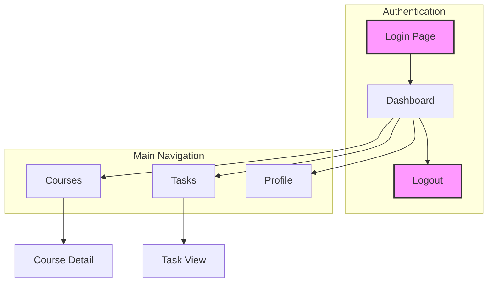
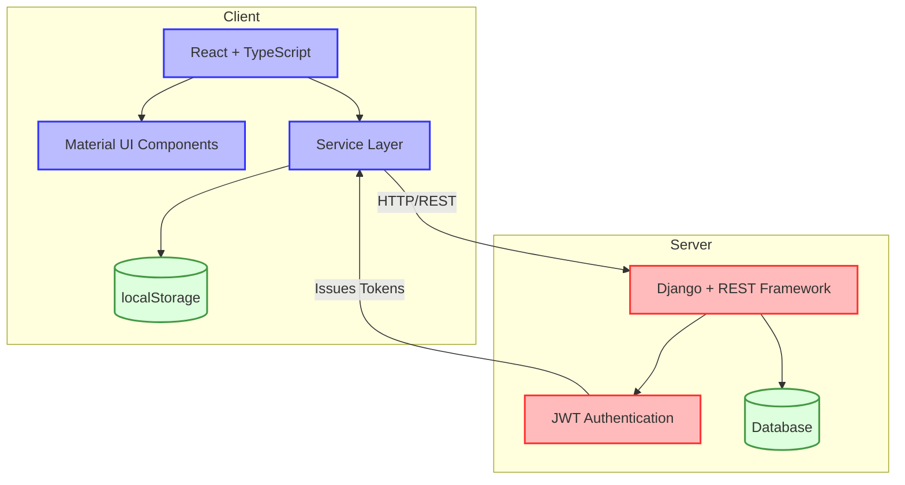
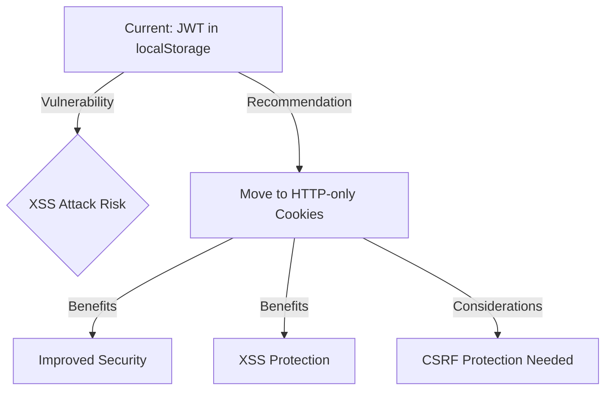

# Learning Platform Site Map and Usability Analysis

## Site Structure Diagram

## Navigation Structure

The site includes the following main navigation elements:

- Dashboard (`/dashboard`)
- Courses (`/courses`)
- Tasks (`/tasks`)
- Profile (`/profile`)
- Authentication (Login/Logout)

## Pages Analysis

### Login Page

- **Path**: `/login`
- **Components**:
  - Username field (input, required)
  - Password field (password, required)
  - Login button (submit)
- **Findings**:
  - Authentication uses JWT with access and refresh tokens
  - Tokens stored in localStorage (security concern)
  - Recommendation: Consider using HTTP-only cookies for better security

### Dashboard

- **Path**: `/dashboard`
- **Components**:
  - Header with user name
  - Navigation panel
  - Role indicator (student)
  - Dashboard content
- **Findings**:
  - User role is clearly displayed in the header
  - Consistent navigation bar across all authenticated pages

### Courses

- **Path**: `/courses`
- **Components**:
  - "Available Courses" heading
  - Course search field
  - Course list (multiple items)
  - Pagination (10 pages)
- **Findings**:
  - Previously encountered session verification issues appear to be resolved
  - Enrollment status clearly indicated for each course
  - Course list shows a mix of regular courses and E2E test courses
  - Recommendation: Consider filtering out test courses in production environment
  - Pagination implemented for courses list

### Tasks

- **Path**: `/tasks`
- **Components**:
  - "Your Learning Tasks" heading
  - Task cards (multiple)
  - "View Task" buttons
- **Findings**:
  - Tasks appear to be organized by course
  - Tasks include both regular assignments and quizzes
  - Markdown formatting is supported and rendered properly in task descriptions
  - Due dates are displayed but without actual dates
  - Recommendation: Add actual due dates to improve time management for students

### Profile

- **Path**: `/profile`
- **Components**:
  - "User Profile" heading
  - Profile Details section
  - User information (Username, Email, Role)
- **Findings**:
  - Profile page is minimal with basic user information
  - No edit functionality available for profile information
  - Recommendation: Consider adding ability to update email or password

## Global Findings

| ID | Title | Category | Description | Severity | Status |
|----|-------|----------|-------------|----------|--------|
| AUTH-001 | JWT-based auth with localStorage | Security | The application uses JWT tokens stored in localStorage | Medium | Active |
| SESSION-001 | Session verification inconsistency | Authentication | Earlier testing revealed session termination when navigating to certain pages | Low | Resolved |
| UI-001 | Consistent navigation structure | UX | The application maintains consistent navigation elements across authenticated pages | Positive | N/A |
| CONTENT-001 | Test content in production | Data Management | E2E test courses are visible alongside regular courses | Low | Active |

## Architecture Overview

### Frontend

- Framework: React with TypeScript
- UI Library: Material UI
- Service Layer: Class-based service architecture (per ADR-013)

### Backend

- Framework: Django with REST framework
- Auth Mechanism: JWT (access and refresh tokens)

### Authentication

- Type: JWT
- Storage: localStorage
- Token Refresh: Implemented for session persistence
- Access Control: Role-based (student, instructor, admin roles observed)

## Key Insights & Recommendations

### Security Considerations

### Usability Enhancement Opportunities

| Area | Current State | Recommendation | Priority |
|------|--------------|----------------|----------|
| Content Management | Test courses visible in production | Implement environment filtering | Medium |
| Profile Management | Read-only profile information | Add edit capabilities | Medium |
| Task Management | Missing actual due dates | Add date information | High |
| Session Handling | Previously encountered issues | Monitor for recurrence | High |
| Error Feedback | Limited validation feedback | Enhance error reporting | Medium |

### Authentication Flow Analysis

The current JWT authentication implementation has these characteristics:

1. **Client-side storage**: Tokens stored in localStorage
2. **Token refresh mechanism**: Implemented but experiencing occasional issues
3. **Role-based access**: "student" role observed with appropriate restrictions

### Implementation Plan

1. **Security Enhancement**: Move JWT tokens from localStorage to HTTP-only cookies
   - Update authentication service in frontend
   - Modify backend token issuance
   - Add CSRF protection mechanisms

2. **Content Filtering**: Implement environment-based filtering for test content
   - Add environment flag to course records
   - Modify course retrieval queries

3. **User Experience Improvements**:
   - Add profile editing capabilities
   - Implement due date functionality for tasks
   - Enhance feedback mechanisms for form validation

4. **Monitoring**:
   - Add session verification logging
   - Monitor for authentication failures
   - Implement user feedback collection
