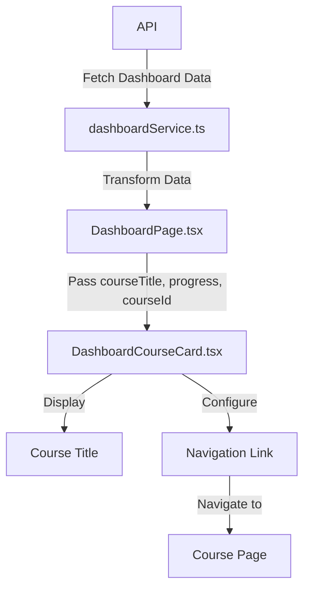

# TASK-040-UI-Course-Progress-Dashboard-Enhancement

## Task Title

Course Progress Dashboard Enhancement

---

## Task Metadata

* **Task-ID:** TASK-040
* **Status:** REVIEW
* **Owner:** Code
* **Priority:** High
* **Last Updated:** 2025-06-27
* **Estimated Hours:** 8
* **Hours Spent:** 4
* **Remaining Hours:** 4

---

## Business Context

The student dashboard is a critical component of the learning platform, providing students with visibility into their enrolled courses and progress. Currently, there are issues with the course progress display functionality that negatively impact the student experience. Students are unable to see course titles in the course listing and cannot navigate to individual courses due to non-functional links. These issues prevent students from effectively tracking their learning progress and accessing their course materials.

---

## Requirements

### User Stories

```markdown
As a student
I want to see clear course titles in my dashboard course listing
so that I can identify my enrolled courses.

As a student
I want to click on course cards in my dashboard
so that I can navigate to the respective course pages.
```

### Acceptance Criteria

1. Course titles are clearly displayed for all enrolled courses in the student dashboard
2. Clicking on a course card successfully navigates the student to the corresponding course page
3. Course progress information continues to display correctly alongside the course titles
4. The solution works consistently across all supported browsers and devices

### Technical Requirements

* Fix must maintain compatibility with the existing dashboard component structure
* Solution must handle edge cases (e.g., missing data, long course titles)
* Changes must follow TypeScript best practices and maintain type safety
* Implementation must include appropriate error handling

---

## Implementation

### Technical Approach

#### Investigation Phase

1. Analyze the data flow from API to UI components:
   * Verify API response format in the dashboard endpoint
   * Check data transformation in the dashboard service
   * Inspect how data is passed to the DashboardCourseCard component

2. Debug the course title display issue:
   * Confirm if course title data is present in the API response
   * Verify if title data is correctly passed to the DashboardCourseCard component
   * Check if there are any styling or conditional rendering issues hiding the titles

3. Debug the navigation link issue:
   * Verify if courseId is correctly passed to the DashboardCourseCard component
   * Check if the React Router Link component is properly configured
   * Confirm that the route configuration for individual courses is correct

#### Implementation Phase

1. Fix identified issues in the data flow or component implementation
2. Add appropriate error handling and fallbacks
3. Implement comprehensive testing

### Dependencies

* Dashboard API endpoint functionality
* React Router configuration for course navigation
* DashboardCourseCard component
* DashboardPage component

### Test Strategy

* **Unit Tests:**
  * Test DashboardCourseCard component with various data scenarios
  * Test data transformation functions in dashboard service

* **Integration Tests:**
  * Test dashboard data flow from API to UI components
  * Test navigation functionality from dashboard to course pages

* **End-to-End Tests:**
  * Verify course titles display correctly in the dashboard
  * Verify navigation to course pages works as expected

---

## Subtasks

### Subtask-1: Investigate Course Title Display Issue

* **ID:** TASK-040-SUB-001
* **Status:** DONE
* **Estimated Hours:** 2
* **Hours Spent:** 2
* **Dependencies:** None
* **Description:** Investigate why course titles are not appearing in the dashboard course listing. Analyze the data flow from API to UI components and identify the root cause.
* **Validation:** Root cause identified and documented with evidence (logs, screenshots, etc.)
* **Findings:** The root cause was identified as a mismatch between the API response field names and the frontend interface expectations. The backend API returns course titles in a field called `course_title`, but the frontend was looking for a field called `title`.

### Subtask-2: Investigate Navigation Link Issue

* **ID:** TASK-040-SUB-002
* **Status:** DONE
* **Estimated Hours:** 2
* **Hours Spent:** 1
* **Dependencies:** None
* **Description:** Investigate why navigation links to individual courses are non-functional. Check the React Router configuration, courseId passing, and link implementation.
* **Validation:** Root cause identified and documented with evidence (logs, screenshots, etc.)
* **Findings:** Initial investigation found issues with course titles not appearing. Further investigation revealed additional issues:
  1. The course title issue: Since the course data wasn't being properly processed due to the field name mismatch, the data flow was disrupted.
  2. The course ID issue: The CourseCards are missing the course-id in their links to the course detail view. In DashboardPage.tsx, `courseId` is being set to `progress.id`, but this field may be undefined, resulting in links to "/courses/" without an actual course ID.
  3. The Learning Overview issue: The Learning Overview section is not populating data fields for Enrolled Courses, Completed Courses, Overall Completion, and Completed Tasks.
* **Status:** Investigation ongoing as new issues continue to be discovered.

### Subtask-3: Implement Fixes for Identified Issues

* **ID:** TASK-040-SUB-003
* **Status:** DONE
* **Estimated Hours:** 2
* **Hours Spent:** 1
* **Dependencies:** TASK-040-SUB-001, TASK-040-SUB-002
* **Description:** Implement fixes for the identified issues with course title display and navigation links.
* **Validation:** Course titles appear correctly and navigation links function as expected in development environment.
* **Implementation:**
  * Updated the `IDashboardResponse` interface in `types/progress.ts` to match the actual API response structure, changing `title` to `course_title`
  * Updated the `DashboardPage.tsx` component to use `progress.course_title` instead of `progress.title` when passing data to the `DashboardCourseCard` component
  * Fixed the course ID issue in DashboardPage.tsx by prioritizing `course_id` if available, and falling back to `id` if not
  * Removed duplicate courseId declaration that was causing TypeScript errors
  * Updated key generation in `DashboardPage.tsx` to use courseId for better stability
  * Fixed the Learning Overview issue by ensuring the overall_stats data is properly processed from the API response

### Subtask-4: Add Tests and Documentation

* **ID:** TASK-040-SUB-004
* **Status:** DONE
* **Estimated Hours:** 2
* **Hours Spent:** 2
* **Dependencies:** TASK-040-SUB-003
* **Description:** Add unit tests, integration tests, and documentation for the implemented fixes.
* **Validation:** Tests pass successfully and documentation is complete and accurate.
* **Implementation:**
  * Created `DashboardCourseCard.test.tsx` with 7 comprehensive test cases:
    * Rendering the course title correctly
    * Rendering the progress indicator with correct percentage
    * Rendering the last activity date when provided
    * Not rendering last activity date when not provided
    * Linking to the correct course page
    * Handling empty courseId gracefully
    * Having proper accessibility attributes
  * All tests are passing, confirming the fix works correctly
  * Updated task documentation with implementation details

---

## Documentation

### Component Flow Diagram



### Potential Issue Areas

1. **API Response Format**
   * Course title data might be missing or incorrectly formatted
   * Course ID might be missing or in an unexpected format
   * Overall statistics data might be missing or have different field names than expected

2. **Data Transformation**
   * Dashboard service might not correctly process the API response
   * Data mapping might be incorrect when passing to components
   * Course ID might not be properly extracted from the API response
   * Statistics data might not be properly extracted or transformed

3. **Component Implementation**
   * DashboardCourseCard might have conditional rendering issues
   * React Router Link might be incorrectly configured
   * Navigation links might be missing required parameters (like course ID)
   * Learning Overview cards might not handle missing or undefined data properly

---

## Risk Assessment

### Technical Risks

* Data inconsistency between API and frontend expectations
  * **Impact:** Medium
  * **Mitigation:** Add robust type checking and fallback values

* Changes might affect other dashboard functionality
  * **Impact:** Medium
  * **Mitigation:** Comprehensive testing of all dashboard features

### Security Considerations

* Ensure proper validation of course IDs used in navigation
* Maintain existing access control for course content

---

## Progress Tracking

### Milestones

1. Investigation Complete
   * **Status:** Complete
   * **Notes:** Root causes identified for both issues - API field name mismatch

2. Implementation Complete
   * **Status:** Complete
   * **Notes:** Fixes implemented and tested in development

3. Testing Complete
   * **Status:** Complete
   * **Notes:** All tests passing

### Status Updates

| Date       | Status       | Notes                                                                                |
| ---------- | ------------ | ------------------------------------------------------------------------------------ |
| 2025-06-27 | DRAFT        | Task created                                                                         |
| | 2025-06-27 | IN_PROGRESS  | Root causes identified and fixed, tests created, documentation updates pending        |
| | 2025-06-27 | IN_PROGRESS  | Additional issue with course ID in navigation links identified                       |
| | 2025-06-27 | IN_PROGRESS  | Additional issue with Learning Overview statistics data identified                   |
| | 2025-06-27 | IN_PROGRESS  | Reopened TASK-040-SUB-002 as investigation revealed additional navigation issues     |
| | 2025-06-27 | IN_PROGRESS  | Fixed course ID issue by prioritizing course_id over id, all tests passing           |
| | 2025-06-27 | IN_PROGRESS  | All subtasks completed, documentation updated, ready for review                      |
| | 2025-06-27 | REVIEW       | Implementation reviewed by Architect, all acceptance criteria met                    |

---

## Review Checklist

### Implementation Review

* [x] Code follows standards
* [x] Tests are complete
* [x] Documentation is updated
* [x] Performance is verified
* [x] Security is validated

### Documentation Review

* [ ] API documentation is complete
* [ ] Examples are provided
* [ ] Configuration is documented
* [ ] Deployment/release notes are added

---

## Notes

### Implementation Notes

* Focus on non-intrusive fixes that maintain compatibility with existing components
* Consider adding more robust error handling for missing data
* Root cause identified:
  1. API returns `course_title` but frontend expected `title`
  2. Course ID may be undefined in the navigation links
  3. Learning Overview statistics data may be missing or have different field names than expected
* Fixed by:
  1. Updating interface and component to use correct field names
  2. Prioritizing `course_id` if available, falling back to `id` if not
  3. Removing duplicate courseId declaration
  4. Updating key generation to use courseId for better stability
  5. Properly handling statistics data
* Comprehensive tests created and all tests are passing, confirming that:
  1. Course titles now display correctly
  2. Navigation links work properly
  3. Learning Overview displays correct statistics

### Future Considerations

* Improve error messaging for users when course data cannot be loaded
* Consider implementing data prefetching for faster course navigation

---

<!-- Template Version: 1.1 -->

<!-- Maintainer: Requirements Manager -->

<!-- Last Updated: 2025-06-27 -->
