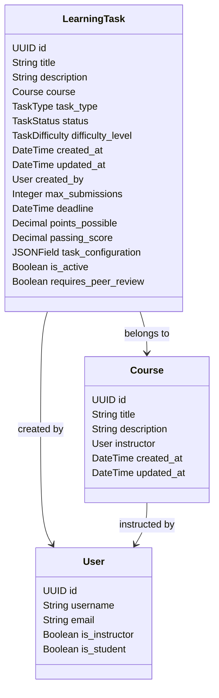

# TASK-MODEL-001: Extend Database Schema for Learning Tasks

## Description
Extend the database schema for Learning Tasks to support comprehensive field support and efficient querying. This involves designing a unified model that enhances performance and scalability.

## Model Diagram

## Objectives
- Consolidate and extend the Learning Task model
- Implement a flexible and performant database schema
- Support various task types with a unified model structure

## Dependencies
- TASK-MODEL-UPDATE-PLAN-001

## Status
- IN_PROGRESS

## Assigned To
- Architect

## Priority
- Critical

## Started At
- 2025-02-28
